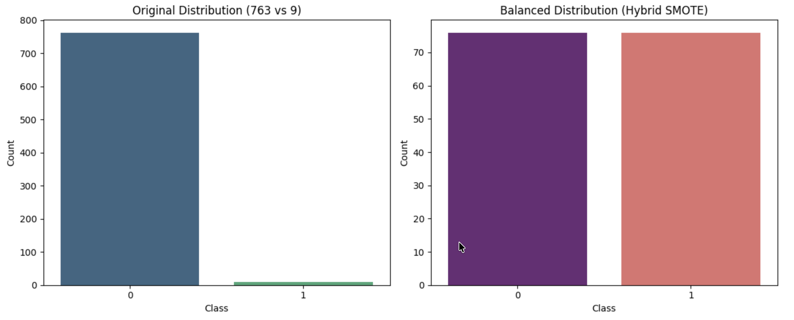

# Sampling Techniques & ML Model Performance Analysis

**BY**: Gurkirat Singh  
**Roll Number**: 102303256  
**Group**: 3C21 

All results and analyses were generated from the execution of [`Sampling.ipynb`](https://github.com/Gurkirat90/Sampling/blob/main/Sampling.ipynb).

---

##  Data Balancing Approach

The dataset was highly imbalanced, so a hybrid sampling strategy was applied.  
First, **SMOTE** was used to generate synthetic samples for the minority class up to 10% of the majority class. Then, **Random Undersampling** reduced the majority class to match the minority class.  

This approach avoids excessive synthetic data while achieving a balanced dataset, leading to more reliable model training and evaluation.

---



---

```text
#  Sampling Techniques Used

To study the effect of sampling on model performance, five sampling methods were applied to the balanced dataset.
Each method generated a fixed-size sample (`n`) with different data selection characteristics.

1. Simple Random Sampling  
Randomly selects instances with equal probability.  
 Provides an unbiased baseline representation.

2. Systematic Sampling  
Selects every k-th instance starting from a random index.  
 Ensures uniform coverage but may miss subtle patterns.

3. Stratified Sampling  
Samples equally from each class based on the target variable (`Class`).  
 Preserves class balance and is effective for imbalanced data.

4. Cluster Sampling  
Selects random subsets of the dataset to simulate cluster-based selection.  
 Efficient but may introduce bias if clusters are not representative.

5. Bootstrap Sampling  
Random sampling with replacement, allowing repeated instances.  
 Improves robustness and model stability.

## Key Insight  
Different sampling strategies significantly influence model performance.  
In highly imbalanced datasets, stratified and bootstrap sampling provide more reliable and consistent results.
```

---

| Model | Simple Random | Systematic | Stratified | Cluster | Bootstrap |
|-------|-------------|----------|----------|--------|----------|
| M1: Logistic Regression | 94.80 | 89.61 | 92.21 | 96.10 | 97.40 |
| M2: Decision Tree | 100.00 | 100.00 | 100.00 | 97.40 | 97.40 |
| **M3: Random Forest (Winner)** | **100.00** | **97.40** | **100.00** | **100.00** | **100.00** |
| M4: SVC | 63.64 | 57.14 | 63.64 | 67.53 | 72.73 |
| M5: Extra Trees | 100.00 | 97.40 | 98.70 | 100.00 | 100.00 |

---

## Performance Analysis

- Random Forest (M3) achieved the most consistent and highest accuracy across all sampling techniques, making it the best-performing model.  
- Extra Trees (M5) and Decision Tree (M2) also showed strong performance, while Logistic Regression (M1) performed moderately well.  
- SVC (M4) showed significantly lower accuracy, indicating sensitivity to the resampled data distribution.  

Overall, ensemble tree-based models combined with balanced sampling proved to be the most reliable approach for this dataset.

